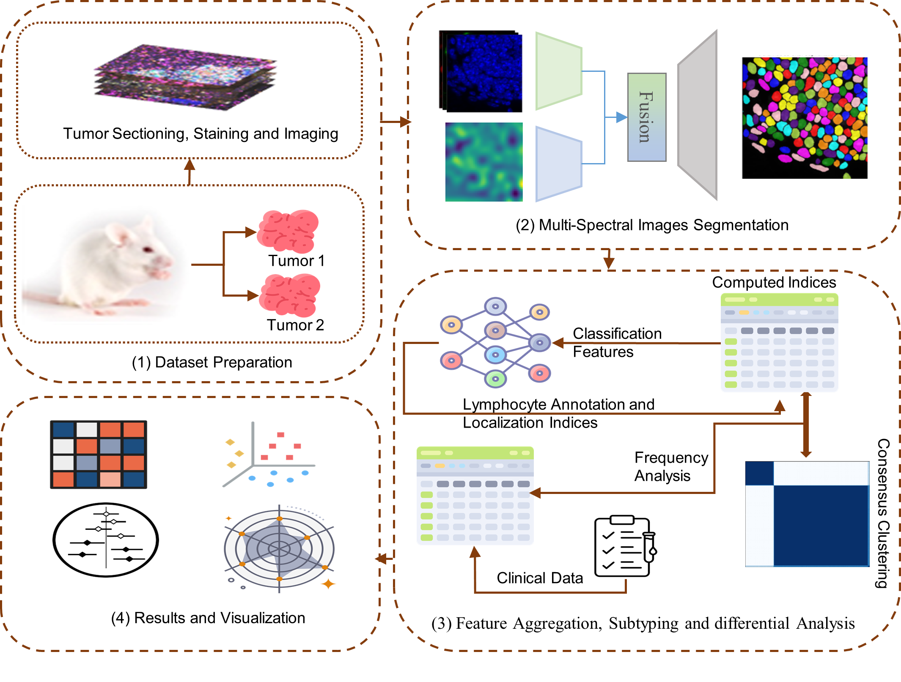
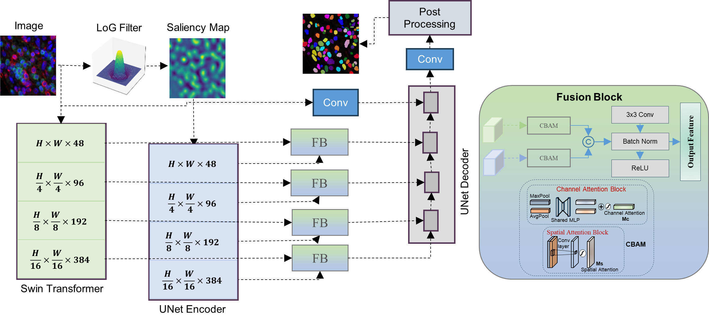
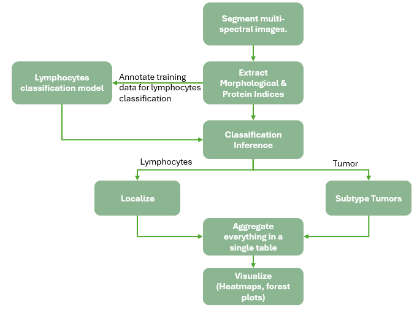
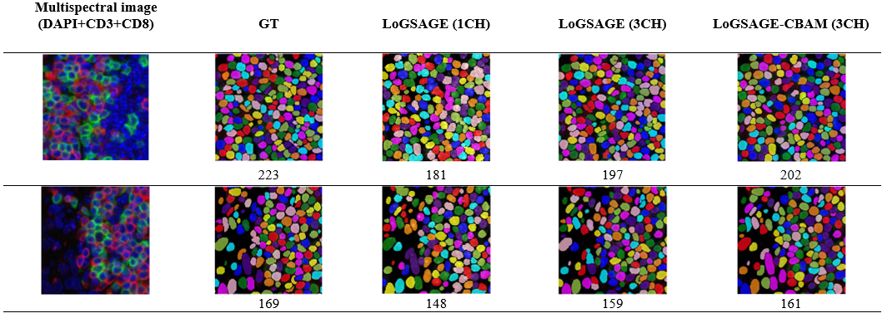
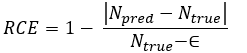

# Cellular Profiling and Subtyping of Breast Cancer Tumor Microenvironment (TME)

This repository contains the implementation for **cellular profiling and subtyping of breast cancer TME**, leveraging the **LoGSAGE-CBAM** model for robust nuclear segmentation and downstream analysis to uncover tumor subtypes and immune phenotypes.

---

## 🔬 Overview

This project addresses the complexity of the tumor microenvironment by:

* **Nuclear Segmentation**: Accurate segmentation of densely packed nuclei in multispectral immunofluorescence images using LoGSAGE-CBAM.
* **Feature Extraction**: Morphometric and protein expression-based profiling of each cell.
* **Lymphocyte Classification**: Classification of lymphocytes using a multi-layer perceptron (MLP).
* **Tumor Subtyping**: Phenotype-driven tumor subtype discovery and association with growth latency and molecular expression patterns.

---

## 🌟 Highlights

* Introduces **LoGSAGE-CBAM**, a dual-encoder segmentation model combining LoG-based saliency and Swin Transformer encoding.
* Incorporates **curvature-aware loss** to enhance biological accuracy in nuclear boundaries.
* Enables **cell classification and spatial profiling** using extracted cellular indices.
* Reveals **subtype-specific immune and morphological signatures** predictive of growth and latency.

---

## 🔁 Pipeline

The pipeline integrates imaging, segmentation, feature extraction, classification, clustering, and statistical analysis.

<p align="center">
  
</p>

1. Tumor harvesting, staining, and multispectral imaging
2. Nuclear segmentation using LoGSAGE-CBAM
3. Feature extraction and cellular classification
4. Tumor subtyping and clinical association
5. Visualization and downstream analysis

---

## 🧠 Model Architecture

<p align="center">
  
</p>

LoGSAGE-CBAM consists of two parallel encoders:

* A **saliency encoder** using Laplacian-of-Gaussian filtered DAPI to highlight nuclear structures based on UNet encoder
* A **Multi-spectral images encoder** based on a Swin Transformer
* A **CBAM-based fusion block** to adaptively merge both representations
* A UNet decoder
* Model trained with a **composite loss**:

  * **Dice Loss** for overlap accuracy
  * **Curvature Loss** for smooth, accurate boundaries

---

## 🧪 Analysis Workflow

<p align="center">
  
</p>

## 1) **Segment Tumor Microenvironment Images (LoGSAGE-CBAM)**

**Goal:** train the nuclear segmentation model on paired images/masks.

### a) Create & activate the environment

```bash
conda create -n CellProfiling python=3.10 -y
conda activate CellProfiling
python -m pip install --upgrade pip setuptools wheel
pip install -r requirements.txt
# ensure repo modules (e.g., segmentation_model) are importable
export PYTHONPATH="$(pwd):$PYTHONPATH"
```

### b) Model training

Train **LoGSAGE-CBAM** on paired images and masks.

```bash
# from repo root (optional but recommended)
export PYTHONPATH="$PWD/src:$PYTHONPATH"

python src/segmentation_model/train.py \
  --images_dir "$IMAGES" \
  --masks_dir  "$MASKS" \
  --output_dir "$OUT" \
  --model swin_T_1 \
  --epochs 100 \
  --batch_size 4 \
  --lr 1e-4 \
  --val_split 0.2 \
  --seed 42
```

**Arguments**

* `--images_dir` *(required)*: Folder of training images (e.g., `.czi` or pre-extracted 3-channel TIFF/PNG as expected by the dataloader).
* `--masks_dir`  *(required)*: Matching **binary** masks (0/1 or 0/255), same filenames as images.
* `--output_dir` *(required)*: Where checkpoints, logs, and metrics will be saved.
* `--model` *(default: `swin_T_1`)*: Backbone preset used in our experiments.
* `--epochs` *(default: 100)*: Number of training epochs.
* `--batch_size` *(default: 4)*: Adjust based on GPU memory.
* `--lr` *(default: 1e-4)*: Initial learning rate.
* `--val_split` *(default: 0.2)*: Fraction of data used for validation.
* `--seed` *(default: 42)*: Reproducibility.

**Expected folder layout**

```
$IMAGES/
  sample_001.czi
  sample_002.czi
  ...

$MASKS/
  sample_001.png   # binary mask for sample_001
  sample_002.png
  ...
```

**Outputs in `$OUT`**

* `checkpoints/epoch_XX.pth` – model weights
* `best.pth` – best checkpoint by validation metric
* `train.log` – epoch metrics (losses, Dice, etc.)
* Optional plots/CSVs depending on the script configuration

**Tips**

* If you run out of memory: lower `--batch_size` or use gradient accumulation (if supported).
* If validation Dice plateaus early: try `--lr 5e-5` or light augmentation (see dataset transforms in `src/segmentation_model/dataset/`).
* Ensure masks are **clean binary** (remove small speckles/holes) to stabilize training.


### c) Model inference

Run LoGSAGE-CBAM on your multi-spectral images to produce **binary masks** and **instance labels** (watershed).

```bash
# from repo root
export PYTHONPATH="$PWD/src:$PYTHONPATH"

python src/analysis/Generate_masks.py \
  --model /home/sahar/CellScopes-TME/src/segmentation_model/saved_models/LoGSAGE_Multispec_sigma_Fusion3.pth \
  --images /home/sahar/CellScopes-TME/src/analysis/Test_images \
  --out-masks /home/sahar/CellScopes-TME/src/analysis/Test_images/LoGSAGE-CBAM_masks \
  --out-labels /home/sahar/CellScopes-TME/src/analysis/Test_images/LoGSAGE-CBAM_labels \
  --thresh 0.5 \
  --min-distance 9
```

**Arguments**

* `--model` *(required)*: Path to trained weights (`.pth`).
* `--images` *(required)*: Folder containing the input `.czi` images.
* `--out-masks`: Output folder for **binary masks** (`*_mask.png`). Auto-created.
* `--out-labels`: Output folder for **instance labels** (`*_labels.tiff`, 16-bit). Auto-created.
* `--thresh` *(default: 0.5)*: Probability threshold to binarize the model output.
* `--min-distance` *(default: 9)*: Peak spacing for `peak_local_max` used to seed the **watershed** (larger → fewer splits; smaller → more splits).

**Outputs**

* `LoGSAGE-CBAM_masks/<name>_mask.png` → 0/255 binary mask
* `LoGSAGE-CBAM_labels/<name>_labels.tiff` → per-nucleus instance IDs (0 = background)

**Notes**

* Make sure `PYTHONPATH` includes `src/` so the model modules can be imported.
* If you see **under-segmentation** (merged nuclei), try lowering `--min-distance` (e.g., 6–7) or raising `--thresh` slightly.
* If you see **over-segmentation** (too many splits), raise `--min-distance` (e.g., 11–13) or lower `--thresh` a bit.


---

## 2) Extract Morphological & Protein Indices

* Compute area, elongation, solidity, and intensities for DAPI, CD3, CD8, Ki67, Caspase, and pSMAD.

```bash
python src/analysis/process_masks.py
```

This reads `src/analysis/Test_images/*.czi` and matching masks in `src/analysis/Test_images/LoGSAGE-CBAM_masks/`, then writes `src/analysis/Processed_Images_Data.xlsx` with area, elongation, solidity, and per-channel intensities (DAPI, CD3, CD8, Ki67, Caspase, pSMAD).

### Test one image this way

```bash
python src/analysis/process_masks.py --only A1818_P0025_4MGRTumor_2
```

---

## 3) Classify Lymphocytes (MLP)

**Goal:** Train a simple MLP to classify cells as lymphocyte vs. non-lymphocyte using morphology + DAPI features.

### Input

Excel file with columns:

* `area`, `pleomorphism` (or `solidity`), `elongation` (or `eccentricity`), `mean_intensity_DAPI`, `total_intensity_DAPI`, `TARGET` (0/1)


### Train & evaluate

```bash
# from repo root
python src/analysis/run_mlp_and_lazy.py \
  --data path/to/excel.xlsx \
  --out-model src/analysis/lymphocyte_mlp.pkl
```

### What you’ll see

```txt
=== MLP Test Metrics (3 d.p.) ===
{
  "Model": "MLPClassifier(64,32)",
  "Accuracy": 0.970,
  "Precision": 0.980,
  "Recall": 0.970,
  "F1": 0.970,
  "AUC": 0.990,
  "N_test": 929
}

=== LazyPredict-style (fallback) Baseline (3 d.p.) ===
             Model  Accuracy  Precision  Recall    F1   AUC
LogisticRegression     0.969      0.956   0.986 0.971 0.995
         LinearSVC     0.970      0.970   0.960 0.960 0.970
      RandomForest     0.970      0.970   0.960 0.960 0.970
               KNN     0.961      0.952   0.976 0.964 0.992
      DecisionTree     0.955      0.946   0.969 0.958 0.954
        GaussianNB     0.953      0.946   0.965 0.956 0.988

[Saved] MLP model -> src/analysis/lymphocyte_mlp.pkl
```

### Run inference on all data

```bash
python src/analysis/classify_lymphocytes.py \
  --data src/analysis/Processed_Images_Data.xlsx \
  --model src/analysis/lymphocyte_mlp.pkl \
  --min-area 100 --max-area 3000 \
  --save-filtered src/analysis/Processed_Images_Data_classified.xlsx \
  --out src/analysis/Processed_Images_Data_filtered.xlsx
```

---

## 4. **Localize Lymphocytes**

```bash
python src/analysis/Lymphocytes_association.py
```

---

## 5. **Cluster indices via Consensus Clustering**

* **a)** Find cluster means (use the notebook `subtyping.ipynb`)
* **b)** Associate each index to the closest cluster using Euclidean distance
* **c)** Aggregate positive indices per tumor using mean
* **d)** Put everything together from tumor/lymphocytes tables
* **e)** Generate heatmaps, t-SNE plots, and **Aggressiveness** curves for subtype comparison.

---

## 📁 Repository Structure

```
.
├── docs
│   ├── Model.png
│   ├── Pipeline.png
│   ├── Results.png
│   ├── metric.png
│   └── flow.png
├── README.md
├── requirements.txt
└── src
    ├── analysis
    │   ├── Test_images
    │   ├── classify_lymphocytes.py
    │   ├── consensus_clustering.py
    │   ├── Generate_masks.py
    │   ├── Lymphocytes_association.py
    │   ├── nuclear_subtyping.ipynb
    │   ├── process_masks.py
    │   ├── run_mlp_and_lazy.py
    │   ├── Processed_Images_Data.xlsx
    │   └── Processed_Images_Data_classified.xlsx
    └── segmentation_model
        ├── dataset
        ├── losses
        ├── models
        ├── saved_models
        └── train.py
```

---

## 📊 Results

<p align="center">
  
</p>

| Task                     | Metric                     | Score |
| ------------------------ | -------------------------- | ----- |
| **Segmentation**         | Dice Score                 | 95.5  |
|                          | Relative Count Error (RCE) | 86.6  |
| **Lymphocyte Detection** | Accuracy                   | 97.0  |
|                          | Precision                  | 98.0  |
|                          | Recall                     | 97.0  |
|                          | AUC                        | 99.0  |
| **Tumor Subtyping**      | # of Subtypes              | 4     |

> **Note:** RCE (Relative Count Error) evaluates segmentation performance by comparing the number of predicted nuclei (N_pred) to the number of ground truth nuclei (N_true). It emphasizes biologically meaningful object-level accuracy.
>
> 

---

## 📬 Contact

For questions or collaborations, contact:
📧 **[saharabulikailik@gmail.com](mailto:saharabulikailik@gmail.com)**
