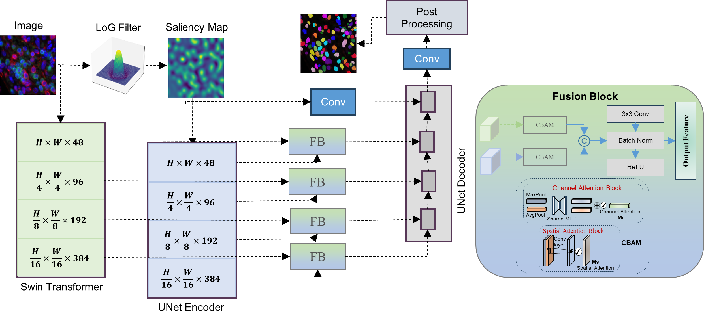

# Cellular Profiling and Subtyping of Breast Cancer Tumor Microenvironment (TME)

This repository contains the implementation for **cellular profiling and subtyping of breast cancer TME**, leveraging the **LoGSAGE-CBAM** model for robust nuclear segmentation and downstream analysis to uncover tumor subtypes and immune phenotypes.

---

## 🔬 Overview

This project addresses the complexity of the tumor microenvironment by:

- **Nuclear Segmentation**: Accurate segmentation of densely packed nuclei in multispectral immunofluorescence images using LoGSAGE-CBAM.
- **Feature Extraction**: Morphometric and protein expression-based profiling of each cell.
- **Lymphocyte Classification**: Classification of lymphocytes using a multi-layer perceptron (MLP).
- **Tumor Subtyping**: Phenotype-driven tumor subtype discovery and association with growth latency and molecular expression patterns.

---

## 🌟 Highlights

- Introduces **LoGSAGE-CBAM**, a dual-encoder segmentation model combining LoG-based saliency and Swin Transformer encoding.
- Incorporates **curvature-aware loss** to enhance biological accuracy in nuclear boundaries.
- Enables **cell classification and spatial profiling** using extracted cellular indices.
- Reveals **subtype-specific immune and morphological signatures** predictive of growth and latency.

---

## 🔁 Pipeline

The pipeline integrates imaging, segmentation, feature extraction, classification, clustering, and statistical analysis.

<p align="center">
  
</p>

1. Tumor harvesting, staining, and multispectral imaging  
2. Nuclear segmentation using LoGSAGE-CBAM  
3. Feature extraction and cellular classification  
4. Tumor subtyping and clinical association  
5. Visualization and downstream analysis  

---

## 🧠 Model Architecture

<p align="center">
  
</p>

LoGSAGE-CBAM consists of two parallel encoders:
- A **saliency encoder** using Laplacian-of-Gaussian filtered DAPI to highlight nuclear structures based on UNet encoder
- A **Multi-spectral images encoder** based on a Swin Transformer
- A **CBAM-based fusion block** to adaptively merge both representations
- A UNet decoder
- Model trained with a **composite loss**:
  - **Dice Loss** for overlap accuracy
  - **Curvature Loss** for smooth, accurate boundaries

---

## 🧪 Analysis Workflow

1. **Segment Tumor Microenvironment Images**  
   - Segment nuclei using LoGSAGE-CBAM.

2. **Extract Morphological & Protein Features**  
   - Compute area, elongation, solidity, and intensities for DAPI, CD3, CD8, Ki67, Caspase, and pSMAD.

3. **Classify Lymphocytes**  
   - Use MLP to classify cells as lymphocytes or non-lymphocytes.

4. **Localize Lymphocytes**  
   - Apply Delaunay triangulation for lymphocytes localization.

5. **Cluster indecies via Consensus Clustering**  
   - Perform clustering on each feature to define high and low values.

6. **Quantify Feature Frequencies per Tumor**  
   - Summarize morphological and expression profiles across tumors.

7. **Visualize Subtype Patterns**  
   - Generate heatmaps, t-SNE plots, and Agressiveness curves (Latency and Growth) for subtype comparison.

---

## 📁 Repository Structure

```
.
├── docs
│   ├── Model.png
│   ├── Pipeline.png
│   └── Results.png
├── lymphocyte_env
│   ├── bin/
│   ├── lib/
│   └── ...
├── README.md
├── requirements.txt
├── saved_model/
├── saved_models/
└── src/
    ├── analysis/
    │   ├── consensus_clustering.py
    │   ├── lymphocyte_association.ipynb
    │   ├── Lymphocytes_classification.py
    │   ├── nuclear_subtyping.ipynb
    │   ├── process_masks.py
    │   └── simK_perweek.ipynb
    └── segmentation_model/
        ├── dataset/
        ├── losses/
        ├── models/
        ├── __pycache__/
        └── train.py
```

---

## 📊 Results

<p align="center">
  
</p>

| Task                     | Metric                     | Score   |
|--------------------------|----------------------------|---------|
| **Segmentation**         | Dice Score                 | 95.5    |
|                          | Relative Count Error (RCE) | 86.6    |
| **Lymphocyte Detection** | Accuracy                   | 97.0    |
|                          | Precision                  | 98.0    |
|                          | Recall                     | 97.0    |
|                          | AUC                        | 99.0    |
| **Tumor Subtyping**      | # of Subtypes              | 4       |

> **Note:** RCE (Relative Count Error) evaluates segmentation performance by comparing the number of predicted nuclei (N_pred) to the number of ground truth nuclei (N_true). It emphasizes biologically meaningful object-level accuracy.
>
> 

---

## 📦 Installation

```bash
conda create -n logsage_cbam python=3.10 -y
conda activate logsage_cbam
pip install -r requirements.txt
```


---

## 📬 Contact

For questions or collaborations, contact:  
📧 **saharabulikailik@gmail.com**
